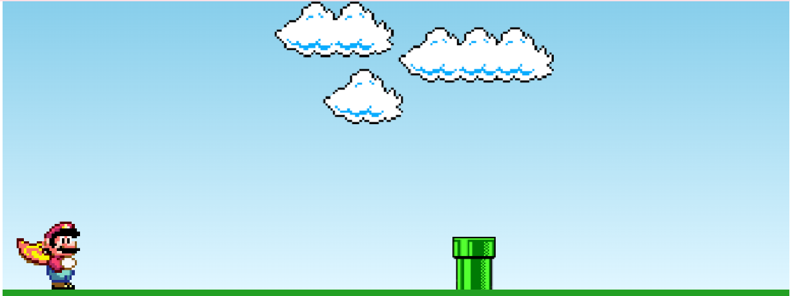
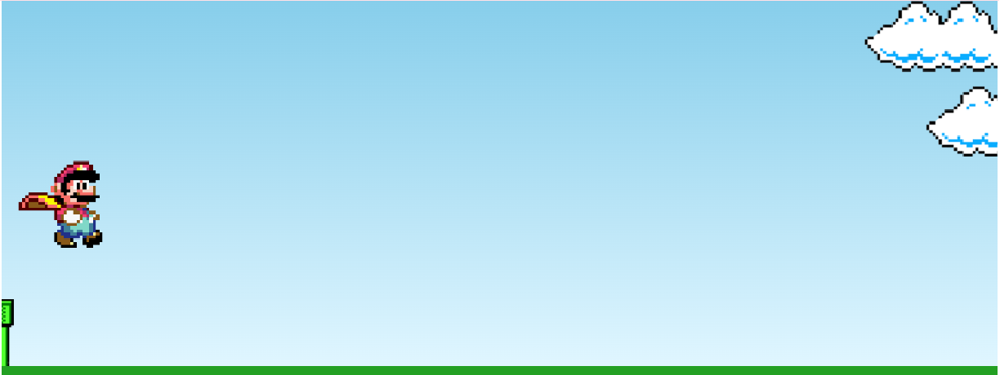
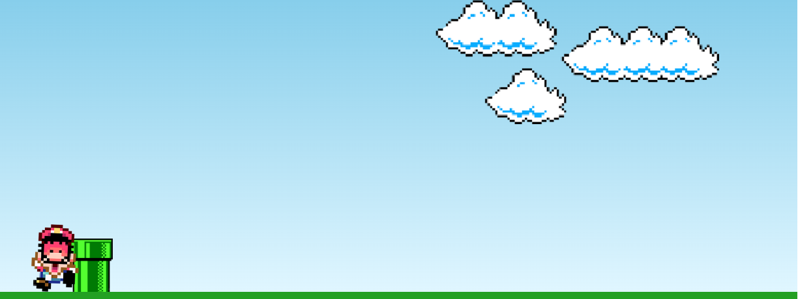

# Projeto Game Mario👾🎮 
## Índice 📍
- <a href="#funcionalidades">Funcionalidades do Projeto</a>
- <a href="#tecnologias">Tecnologias Utilizadas </a>
- <a href="#rodar">Como rodar o Projeto</a>
- <a href="#autor">Autor(a) do Projeto</a>
- <a href="#autor">Layout do Projeto</a>
<hr>

## Funcionalidades do Projeto 📋
- [X] Ação de pular com qualquer tecla
- [Em andamento] Sistema de Pontuação
- [Em andamento] Botão para reiniciar o jogo 
<hr>

## Tecnologias Utilizadas 🛠
1. <a href="https://developer.mozilla.org/pt-BR/docs/Web/HTML">HTML</a>
2. <a href="https://developer.mozilla.org/pt-BR/docs/Web/CSS">CSS</a>
3. <a href="https://developer.mozilla.org/pt-BR/docs/Web/JavaScript">JavaScript</a>
<hr>

## Como rodar o Projeto?
```bash
# Clone este repositório
$ git clone https://github.com/Saraemilyy/Curso-Mario-Game

# Acesse a pasta do projeto no seu terminal 
$ cd Curso-Mario-Game

# Execute o arquivo usando a extensão Live server no Visual Studio Code ou use uma extensão de sua preferência.
```
<hr>

## Autor(a) do Projeto 🧠
- Esse projeto foi inspirado com base no tutorial oferecido pelo canal <a href="https://www.youtube.com/@ManualdoDev">Manual do Dev</a>. Projeto feito para estudo da linguagem Javascript.

<hr>

## Layout Do Projeto





>&copy; Sara Castro 2023 - Developer Full Stack
